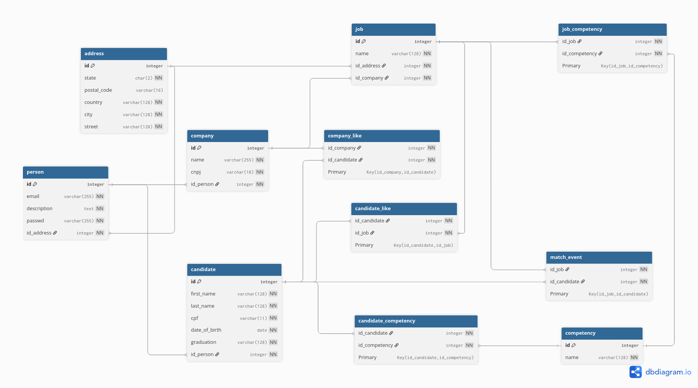

# Linketinder

Uma aplicação que mescla as funcionalidades do Linkedin e do Tinder, para Candidatos darem Match com empresas. Atualmente possui um backend e um frontend isolado, cada um com funcionalidades parciais. O backend está integrado a um banco de dados PostgreSQL.

## Funcionalidades

-   Criação e Leitura de Candidatos e Empresas
-   Empresas podem ter vagas
-   Likes e matches de vagas entre empresas e candidatos

## Tecnologias utilizadas

-   Groovy 4.0.6
-   Spock 2.4
-   JDBC
-   PostgreSQL 42.7.3
-   Gradle 6.9.4
-   Tomcat 9
-   Typescript
-   Vite
-   HTML/CSS

## Backend

### Requisitos

-   JVM 17+
-   Groovy 4.0.6+
-   PostgreSQL 42.7.3
-   Tomcat 9
-   Linux

### Como executar

Inicialmente você precisa ter um servidor Tomcat 9 na pasta /opt/tomcat, com a biblioteca do PostgreSQL 42.7.3 instalada.
Esse [tutorial](https://www.digitalocean.com/community/tutorials/install-tomcat-on-linux) pode ser seguido.

Após o clone, entre na pasta:

```
cd Linketinder-Project/backend
```

Crie um arquivo .env baseado no .env.example e insira as credenciais do seu banco de dados

```
cp .env.example .env
```

Para executar a migração inicial do banco de dados:

```
./gradlew migrate
```

Para inserir dados dummy no banco de dados:

```
./gradlew seed
```

Para compilar o projeto:

```
./gradlew build
```

Para servir o projeto no Tomcat:

```
./gradlew deployToTomcat
```

Para executar os testes unitários:

```
./gradlew test
```

Para utilizar a aplicação devem ser feitas requisições HTTP por meio de alguma ferramenta como o [Postman](https://www.postman.com/). Todos os endpoints com exemplos de requisições podem ser acessados [por esse link](https://web.postman.co/workspace/My-Workspace~6296f6d8-208c-43ea-87b0-12bc2bd28b4f/collection/34668668-960b09bf-1b87-4cfb-b747-56d43bc265a1?action=share&source=copy-link&creator=34668668). 

## Frontend

### Requisitos

-   Node.js 20.19+

### Como executar

Após o clone, entre na pasta:

```
cd Linketinder-Project/frontend
```

Para instalar as dependências:

```
npm install
```

Para transpilar:

```
npm run build
```

Para executar:

```
npm run preview
```

Então a aplicação será servida em http://localhost:4173/

## Banco de Dados

Modelo do banco de dados utilizando a plataforma [dbdiagram](https://dbdiagram.io).



Dentro da pasta de backend/src/main/resources/db existem 3 arquivos, schema, data e queries, com a definição do banco de dados, a inserção de dados dummy e consultas de vagas do ponto de vista de candidatos, likes que uma empresa recebeu e matches que ocorreram no sistema.

## Licença

Este projeto é livre para uso pessoal e acadêmico. Sinta-se à vontade para clonar, modificar e melhorar.
