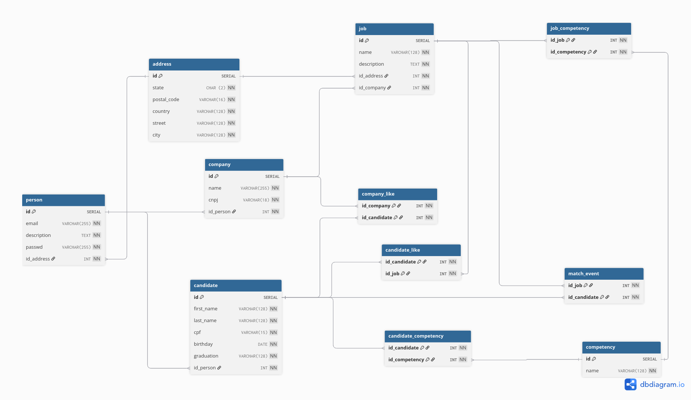

# Linketinder

Uma aplicação que mescla as funcionalidades do Linkedin e do Tinder, para Candidatos darem Match com empresas. Atualmente possui um backend e um frontend isolado, cada um com funcionalidades parciais. O backend está integrado a um banco de dados PostgreSQL.

## Funcionalidades

-   Criação e Leitura de Candidatos e Empresas
-   Empresas podem ter vagas
-   Likes e matches de vagas entre empresas e candidatos

## Tecnologias utilizadas

- Groovy 4.0.6
- Spock 2.4
- JDBC
- PostgreSQL
- Gradle 6.9.4
- Typescript
- Vite
- HTML/CSS

## Backend

### Requisitos

-   JVM 8+
-   Groovy 4.0.6+
-   PostgreSQL 

### Como executar

Após o clone, entre na pasta:

```
cd Linketinder-Project/backend
```

Crie um arquivo .env baseado no .env.example e insira as credenciais do seu banco de dados

```
cp .env.example .env
```

Para executar a migração inicial do banco de dados:

```
./gradlew migrate
```

Para inserir dados dummy no banco de dados:

```
./gradlew seed
```

Para compilar o projeto:

```
./gradlew build
```

Para rodar:

```
./gradlew run
```

Para executar os testes unitários:

```
./gradlew test
```

## Frontend

### Requisitos

-   Node.js 20.19+

### Como executar

Após o clone, entre na pasta:

```
cd Linketinder-Project/frontend
```

Para instalar as dependências:

```
npm install
```

Para executar:

```
npm run preview
```

Então a aplicação será servida em http://localhost:4173/

## Banco de Dados

Modelo do banco de dados utilizando a plataforma [dbdiagram](https://dbdiagram.io).


Dentro da pasta de backend/src/main/resources/db existem 3 arquivos, schema, data e queries, com a definição do banco de dados, a inserção de dados dummy e consultas de vagas do ponto de vista de candidatos, likes que uma empresa recebeu e matches que ocorreram no sistema.

## Licença

Este projeto é livre para uso pessoal e acadêmico. Sinta-se à vontade para clonar, modificar e melhorar.
